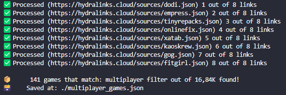

# HydraLauncher Filters

Just a basic setup for finding games by a specific filter inside hydralinks.cloud

## Requirements

📦 [NodeJS](https://nodejs.org/en) Installed

## Usage

Run one of those commands to install dependencies  
`yarn` or `npm i -g yarn & yarn`  

Edit `.env` file with your Filter

Run `yarn start`

Check [this folder](./filters/) with your results and we're done!
